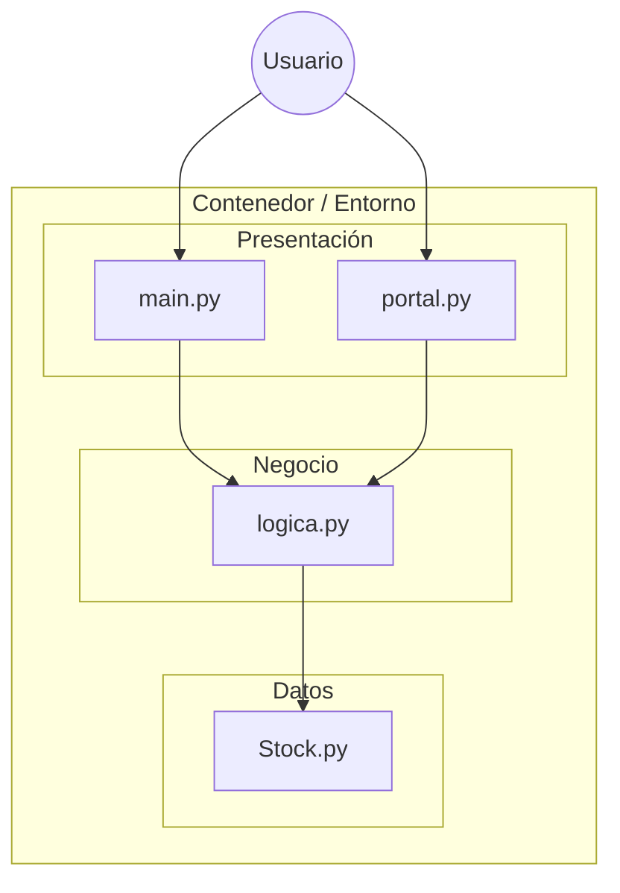

# Trabajo Práctico Integrador - Grupo 07

**Sistema Modular de Gestión de Stock y Portal de Ventas**
 
Desarrollo de Software 2025

[Reportar Bug](https://github.com/FRRe-DS/2025-07-TPI/issues) · [Solicitar Feature](https://github.com/FRRe-DS/2025-07-TPI/issues)

---

## 📑 Tabla de Contenidos

1. [Descripción del Proyecto](#descripcion)
2. [Arquitectura del Sistema](#arquitectura)
3. [Estructura del Repositorio](#estructura)
4. [Instalación y Despliegue](#instalacion)
5. [Configuración de Base de Datos](#bd)
6. [Módulos y Funcionalidades](#modulos)
7. [Tecnologías](#tecnologias)

---

## 📖 Descripción del Proyecto

Este proyecto implementa un sistema integral para la administración de inventarios y la gestión de pedidos de clientes. Diseñado bajo un enfoque modular, el sistema permite desacoplar la lógica de negocio de la interfaz de usuario y la persistencia de datos.

El objetivo principal es simular un entorno real de e-commerce donde interactúan múltiples componentes: un portal de cara al cliente, un validador de reglas de negocio y un gestor de almacén.

---

## 🏗 Arquitectura del Sistema

El diseño sigue una arquitectura en capas para asegurar la escalabilidad y mantenibilidad del código.

## 📂 Estructura del Repositorio

## 🚀 Instalación y Despliegue
Ofrecemos dos formas de ejecutar el proyecto: localmente con Python o mediante Docker.

Opción A: Ejecución con Docker (Recomendada)
Asegúrate de tener Docker instalado y corriendo.

1. Construir la imagen:
cd "Trabajo TP"
docker build -t grupo07-tpi .
2. Correr el contenedor
docker run -it --rm grupo07-tpi

Opción B: Ejecución Local (Python)

1. Clonar el repositorio:
git clone [https://github.com/FRRe-DS/2025-07-TPI.git](https://github.com/FRRe-DS/2025-07-TPI.git)
cd 2025-07-TPI
2. Crear entorno virtual:
python -m venv venv
source venv/bin/activate  # Linux/Mac
.\venv\Scripts\activate   # Windows
3. Ejecutar:
python main.py

---

## ⚙️ Configuración y Base de Datos

El sistema requiere una configuración inicial de la base de datos para funcionar correctamente.

> 📘 **Guía de Setup:**
> Para ver las instrucciones detalladas de tablas, usuarios y scripts de inicialización, consulta el archivo oficial:
> 👉 **[Guía de Configuración de Base de Datos](./TrabajoTP/DATABASE_SETUP.md)**

### Variables de Entorno
Asegúrate de tener un archivo `.env` en la raíz (o configurar las variables en Docker) con los parámetros definidos en la guía anterior.
## 🧩 Módulos y Funcionalidades
🛒 Portal de Ventas

Permite a los usuarios visualizar el catálogo de productos disponibles y realizar pedidos. Se comunica exclusivamente con la capa lógica para confirmar transacciones.

📦 Gestión de Stock

Módulo encargado de mantener la integridad del inventario. Sus funciones incluyen:

Control de stock mínimo.

Actualización de cantidades post-venta.

Gestión de precios.

⚙️ Lógica de Negocio
Actúa como intermediario (Middleware) asegurando que:

No se vendan productos sin stock.

Los precios sean correctos.

Las transacciones se registren adecuadamente.

## 🛠 Tecnologías
Categoría,Tecnología,Uso
Lenguaje,,Lógica de backend y scripts.
Infraestructura,,Containerización y entorno reproducible.
Control de Versiones,,Gestión del código fuente.

 Desarrollo de Software - TPI 2025 

